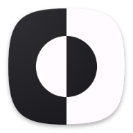
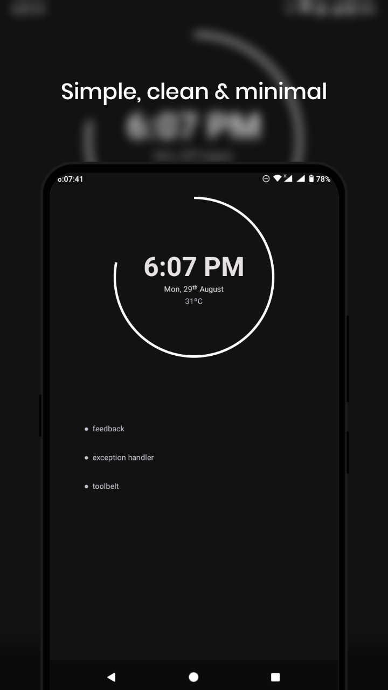
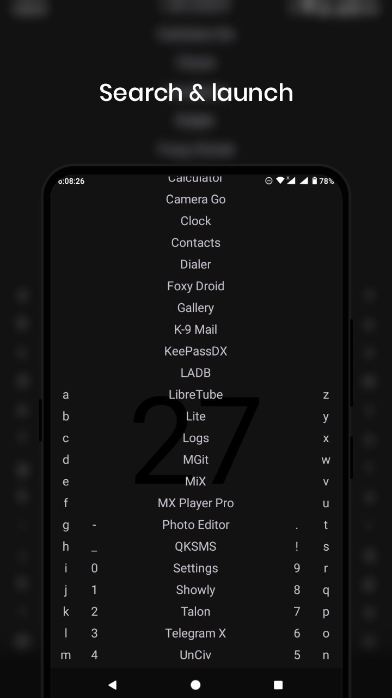
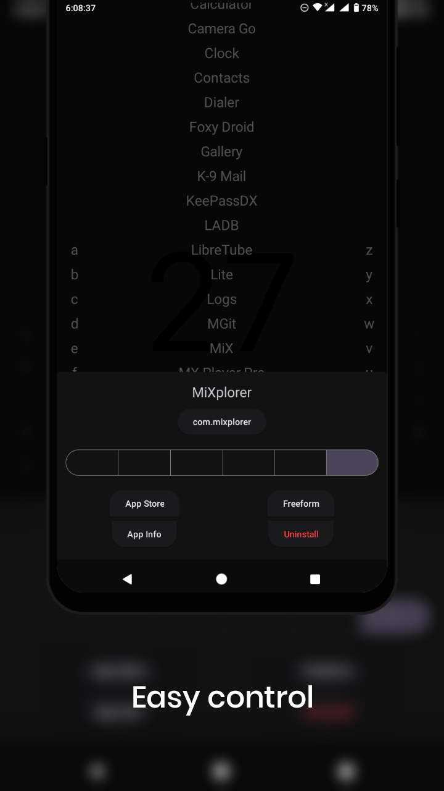
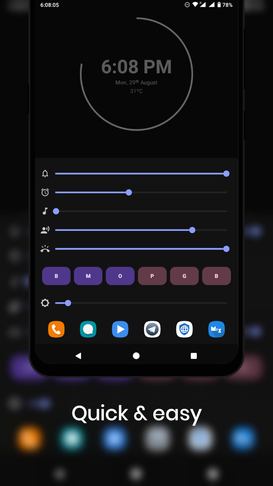
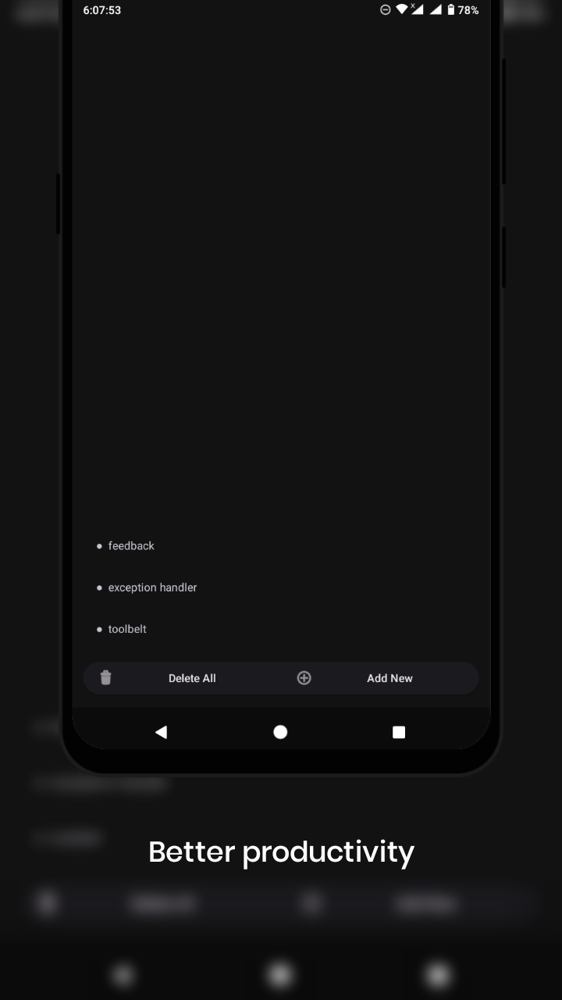
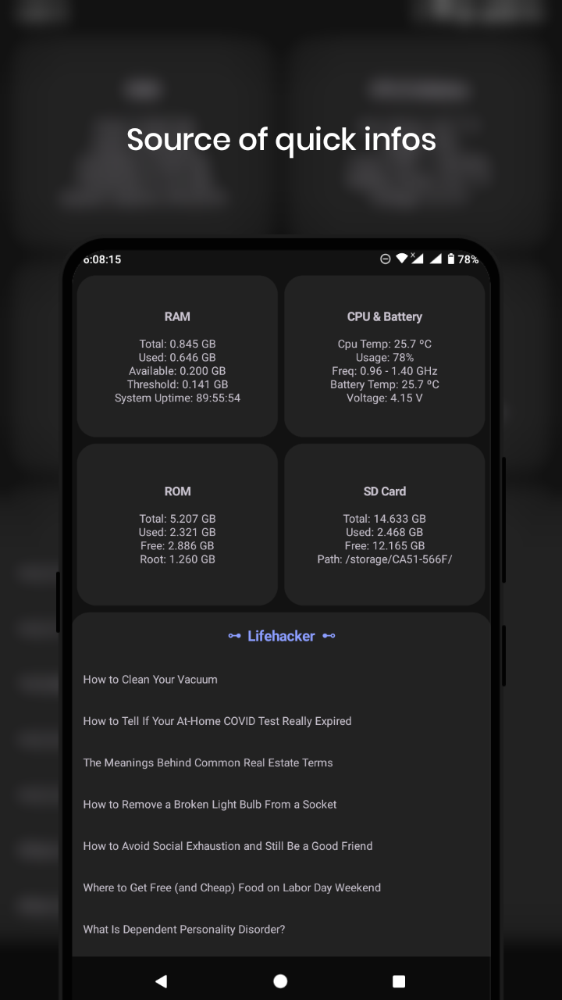
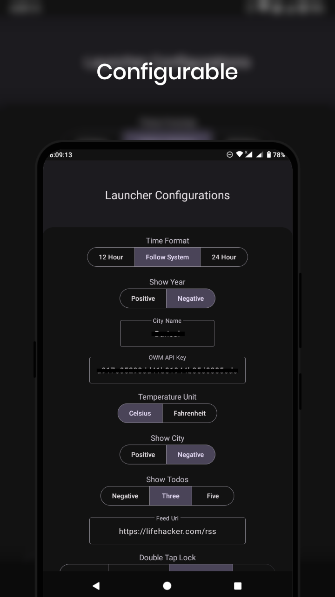
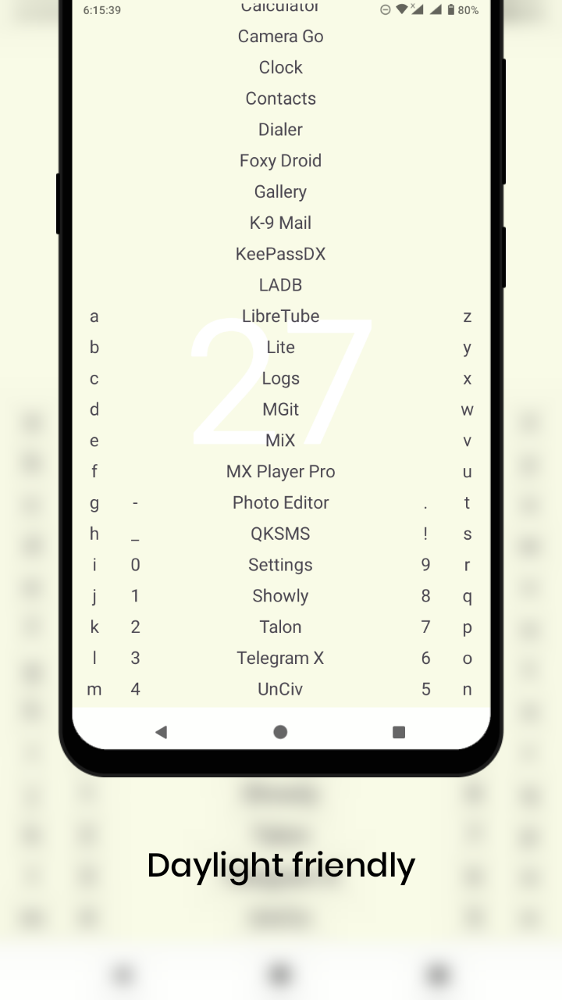

	
    <h2>Lunar Launcher</h2>
    

        
        
        
         
		
        
		
    

## Features/Todo

Global

- [x] Appearances
  - [x] Material Design 3
  - [ ] Material You support
  - [x] Day/night theme
  - [ ] Wallpaper with dim support
- [x] Double tap: lock/sleep
  - [x] Accessibility (SDK >= 28)
  - [x] Device admin
  - [x] Root
- [x] Swipe down: expand notification panel
- [ ] Yet to decide

Home

- [x] Battery status
  - [x] Circular percentage indicator
  - [x] Animation while charging
- [x] Time
  - [x] 12/24 format
- [x] Date
- [x] Weather
  - [x] Provider: OpenWeatherMap
  - [x] Celsius/Fahrenheit
- [x] Todo
  - [x] Add, delete, edit, copy
  - [ ] Auto destructive todo with notify
  - [x] 0-7 items in home screen
  - [x] Access lock

App Drawer

- [x] Quick search
- [x] Launch from search
- [x] Launch in freeform mode
- [x] Total apps count
- [ ] App rename
- [ ] App vault
- [ ] Detailed app info

Feeds

- [x] Device stats
  - This section is temporary, will be replaced with more useful feature.
- [x] RSS

Quick Access

- [x] Favourite apps (<=6)
- [x] Favourite contacts and urls (<=6)
- [x] Control system value
  - [x] Brightness
  - [x] Sound

## Screenshots
As per version 14. Click on any image to enlarge it. To know more, explore and see for yourself.

	
	
	
	
	 
	
	
	
	

## Download
To get updated with the latest build head over to the [Actions](https://github.com/iamrasel/lunar-launcher/actions) tab and choose the latest workflow build from there.

## Permissions
- `android.permission.ACCESS_NETWORK_STATE` - To check for active network connection
- `android.permission.CALL_PHONE` - To make call
- `android.permission.EXPAND_STATUS_BAR` - To expand notification panel
- `android.permission.INTERNET` - To fetch weather and feed data
- `android.permission.REQUEST_DELETE_PACKAGES` - To uninstall apks
- `android.permission.WRITE_SETTINGS` - To change system values like brightness

## Credits
- [https://gitlab.com/biotstoiq/launch](https://gitlab.com/biotstoiq/launch)
- [https://github.com/chrisbanes/insetter](https://github.com/chrisbanes/insetter)

## Donation
Do you like this app? If the answer is yes, then help me to continue this project. My current old laptop, which has only 4gb ram, has been serving me with it's last breaths. So I need to replace it with a decent one for developing, please help me with that. Donate me any amount you wish.

|  | [iamrasel](https://www.buymeacoffee.com/iamrasel) |
|:-----------------------------------------------------------------------------------------------------------------:|:-------------------------------------------------:|
|                  |       `38mRQy6oDJjZNR3xxiNRVS5obqLMnwonFD`        |
|                |   `0x9b2f72a19C78a73dDE4478a6d51BACf198671480`    |

